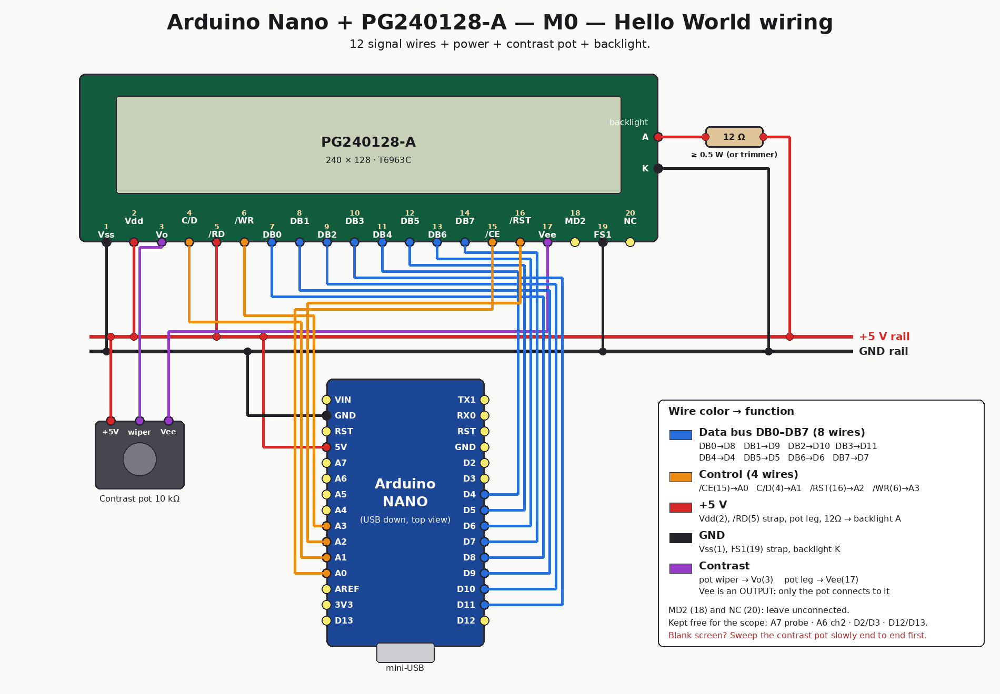

# Arduino Nano oscilloscope on a PG240128-A

> **signal → protection (10 kΩ) → ADC (77 kSps, 8-bit) → hysteresis trigger → auto-scale → voltage readings within ~1 %.**  
> Not bad for a €3 Arduino and a screen from the '90s.

Building a single-channel hobby oscilloscope from an **Arduino Nano** and a **Powertip PG240128-A** 240×128 graphic LCD (T6963C controller) — apparently the first documented Arduino scope on this display.

```
 ┌─────────────────────────────────┬──────────┐
 │      ~~~~                       │ 1V/div   │
 │     /    \        /‾‾\          │ 2ms/div  │
 │ ___/      \______/    \___      │ Trig ↑   │
 │                                 │ 1.02 kHz │
 │  240×128 · T6963C · U8g2        │ 3.3 Vpp  │
 └─────────────────────────────────┴──────────┘
          ▲ probe A7 · encoder D2/D3 · Nano
```

**Expected performance** (research-backed, see docs): 77 kSps capture, clean traces to ~5–10 kHz, 0–5 V and ±20 V ranges, software edge trigger with auto free-run.

## Start here

1. **[docs/00-hello-world-nano.md](docs/00-hello-world-nano.md)** — for-dummies, step-by-step wiring + first "Hello World" on the display. The pin map is already oscilloscope-ready.
2. [docs/04-build-plan.md](docs/04-build-plan.md) — the milestone-by-milestone build plan.



(All wiring diagrams — one per milestone M0–M6, embedded in the [build plan](docs/04-build-plan.md) — are generated by [tools/wiring_diagrams.py](tools/wiring_diagrams.py); edit the script and re-run it if the wiring ever changes.)

## Research library (docs/)

| Doc | Contents |
|---|---|
| [00-hello-world-nano.md](docs/00-hello-world-nano.md) | Nano + display wiring and first sketch, for beginners |
| [01-existing-projects.md](docs/01-existing-projects.md) | Survey of Arduino scope projects (Girino, ArdOsc, GOscillo…), architectures, licenses, what to reuse |
| [02-adc-and-sampling.md](docs/02-adc-and-sampling.md) | ATmega328P ADC: prescalers, free-running mode, real sample rates and resolution |
| [03-analog-front-end-and-trigger.md](docs/03-analog-front-end-and-trigger.md) | Input circuits (0–5 V, AC, ±20 V), protection, safety, trigger design, calibration, BOM |
| [04-build-plan.md](docs/04-build-plan.md) | Pin budget, RAM budget, architecture, milestones M0–M6 |
| [05-build-log.md](docs/05-build-log.md) | Real-hardware progress diary (what actually happened) |
| [06-components.md](docs/06-components.md) | Detailed component list to finish the project (M4–M6), with buy list |

## Companion repository

Display documentation lives in its own repo: **[lcd-pg-240128A](https://github.com/yupipi93/lcd-pg-240128A)** — hardware reference, wiring guides (Arduino/ESP32/Raspberry Pi 5), troubleshooting.

## Status

- ✅ M0 — display hello world — **verified on real hardware 2026-07-17** ([build log](docs/05-build-log.md))
- ✅ M1 — static waveform viewer — **verified on real hardware 2026-07-17** (square wave + 50 Hz hum)
- ✅ M2 — trigger — **verified on real hardware 2026-07-17** (wave stands still)
- ✅ M3 — fast sampling (77 kSps) — **verified on real hardware 2026-07-17** (10-tier time base)
- ✅ M4 — UI (grid, readouts, buttons, auto-scale) — **verified on real hardware 2026-07-17**
- ⬜ M5 — analog front-end board
- ⬜ M6 — polish (2nd channel, pre-trigger, PC streaming…)

## License

MIT — see [LICENSE](LICENSE).
